# 🚨 KRITISCHE CHAT-SYSTEM REPARATUR PLAN

**Projekt**: Conversational Therapy AI  
**Datum**: 22.06.2025  
**Priorität**: KRITISCH  
**Ziel**: Beheben von Nachrichtenverschwinden, Animations-/Farbproblemen und LLM-Modell-Update

---

## 📊 PROBLEMANALYSE

### 🔴 **Priorität 1: Nachrichtenverschwinden**
- **Symptom**: Nachrichten werden gesendet, erscheinen aber nicht oder verschwinden nach kurzer Zeit
- **Ursache**: Race Conditions zwischen [`conversationManager`](frontend/react-components/src/services/conversationManager.js) und React State Updates
- **Kritische Stellen**:
  - [`conversationManager.addMessageToThread()`](frontend/react-components/src/services/conversationManager.js:101)
  - [`setMessages(conversationManager.getThreadMessages())`](frontend/react-components/src/components/ChatFlow07.jsx:369)
  - [`performCleanup()`](frontend/react-components/src/services/conversationManager.js:339) Memory Management

### 🟡 **Priorität 2: Animations- und Farbprobleme**
- **Symptom**: Emotional Blobs zeigen falsche Farben, Animationen ruckeln oder funktionieren nicht
- **Ursachen**:
  - [`EmotionalUrgencyBlob`](frontend/react-components/src/components/EmotionalUrgencyBlob.jsx) verliert Emotionszustand
  - [`UniversalOrbAnimation`](frontend/react-components/src/components/UniversalOrbAnimation.jsx) Farben inkonsistent
  - [`blobManager`](frontend/react-components/src/services/blobManager.js) State-Sync-Probleme

### 🔵 **Priorität 3: LLM-Modell-Update**
- **Aktuell**: [`"Qwen/Qwen3-32B"`](backend/llm.py:15)
- **Ziel**: `"meta-llama/Llama-3.2-3B-Instruct"`
- **URL**: https://chat1.kitegg.de/?model=meta-llama%2FLlama-3.2-3B-Instruct

---

## 🛠️ IMPLEMENTIERUNGS-PLAN

```mermaid
graph TD
    A[🚨 Kritische Fehler beheben] --> B[Phase 1: Message Persistence]
    A --> C[Phase 2: Animation & Farben]
    A --> D[Phase 3: LLM-Modell-Update]
    A --> E[Phase 4: Fehlerbehandlung]
    A --> F[Phase 5: Testing]
    
    B --> B1[State-Management verstärken]
    B --> B2[Message Backup-System]
    B --> B3[Memory Management optimieren]
    B --> B4[Race Condition Fixes]
    
    C --> C1[Emotion-Farb-Mapping reparieren]
    C --> C2[Animation-Konflikte lösen]
    C --> C3[Blob-Lifecycle stabilisieren]
    C --> C4[State-Synchronisation verbessern]
    
    D --> D1[Backend LLM-Konfiguration]
    D --> D2[Integration testen]
    D --> D3[Backward-Compatibility]
    
    E --> E1[Enhanced Logging]
    E --> E2[Error Recovery]
    E --> E3[Graceful Degradation]
    
    F --> F1[Message Persistence Tests]
    F --> F2[Animation Kontinuität Tests]
    F --> F3[Memory Leak Tests]
    F --> F4[End-to-End Tests]
```



---

## 🔧 PHASE 1: MESSAGE PERSISTENCE FIX (KRITISCH)

### **Problembeschreibung**
Nachrichten verschwinden durch Race Conditions zwischen verschiedenen State-Management-Systemen.

### **Lösungsansätze**

#### **1.1 Immutable Message State**
```javascript
// Problem: Mutable State-Updates überschreiben Nachrichten
setMessages(conversationManager.getThreadMessages(currentThreadId));

// Lösung: Immutable State mit Backup
const updateMessages = useCallback((threadId) => {
  const newMessages = conversationManager.getThreadMessages(threadId);
  setMessages(prev => {
    // Backup previous state
    messageBackup.current = prev;
    return [...newMessages];
  });
}, []);
```

#### **1.2 Dual-Storage-System**
- **Primary**: React State für UI-Rendering
- **Backup**: [`conversationManager`](frontend/react-components/src/services/conversationManager.js) für Persistenz
- **Sync**: Bidirektionale Synchronisation mit Conflict Resolution

#### **1.3 Cleanup-Schutz**
```javascript
// In conversationManager.js
performCleanup() {
  // KRITISCH: Niemals aktive Threads löschen
  for (const [threadId, thread] of this.threads) {
    const isActiveThread = threadId === this.currentThread;
    const hasRecentActivity = (Date.now() - thread.lastActivity) < 300000; // 5 min
    
    if (!thread.isActive && !isActiveThread && !hasRecentActivity) {
      this.threads.delete(threadId);
    }
  }
}
```

#### **1.4 Message Recovery System**
- Auto-restore bei Datenverlust
- Rollback-Mechanismus für fehlerhafte Updates
- Persistente Speicherung kritischer Messages

---

## 🎨 PHASE 2: ANIMATION & FARBEN FIX

### **Problembeschreibung**
Emotional Blobs und Orb-Animationen verlieren Zustand, zeigen falsche Farben oder ruckeln.

### **Lösungsansätze**

#### **2.1 Steiner-Farbsystem Stabilisierung**
```javascript
// In steinerColorSystem.js - Robuste Emotion-zu-Farbe-Zuordnung
const emotionColorMap = {
  'joy': { primary: '#FFD700', secondary: '#FFA500', intensity: 0.8 },
  'sadness': { primary: '#4169E1', secondary: '#1E90FF', intensity: 0.6 },
  'anger': { primary: '#DC143C', secondary: '#B22222', intensity: 0.9 },
  'fear': { primary: '#9370DB', secondary: '#8A2BE2', intensity: 0.7 },
  'neutral': { primary: '#87CEEB', secondary: '#ADD8E6', intensity: 0.4 }
};
```

#### **2.2 Centralized Emotion State**
```javascript
// Neuer emotionStateManager.js
class EmotionStateManager {
  constructor() {
    this.currentEmotion = 'neutral';
    this.intensity = 0.5;
    this.listeners = new Set();
  }
  
  updateEmotion(emotion, intensity) {
    this.currentEmotion = emotion;
    this.intensity = intensity;
    this.notifyListeners();
  }
  
  subscribe(callback) {
    this.listeners.add(callback);
    return () => this.listeners.delete(callback);
  }
}
```

#### **2.3 Blob-Lifecycle-Verbesserung**
- Stabilere Decay-Algorithmen
- Smooth Transitions zwischen Emotionen
- Performance-optimierte Re-rendering

#### **2.4 Animation State Synchronisation**
- Unified Animation State zwischen [`EmotionalUrgencyBlob`](frontend/react-components/src/components/EmotionalUrgencyBlob.jsx) und [`UniversalOrbAnimation`](frontend/react-components/src/components/UniversalOrbAnimation.jsx)
- Conflict Resolution bei gleichzeitigen Updates
- Frame-rate-adaptive Rendering

---

## 🤖 PHASE 3: LLM-MODELL-UPDATE

### **Aktuelle Konfiguration**
```python
# backend/llm.py:15
payload = {
    "model": "Qwen/Qwen3-32B",  # ← ÄNDERN
    "messages": messages,
    "stream": False,
}
```

### **Neue Konfiguration**
```python
# backend/llm.py:15
payload = {
    "model": "meta-llama/Llama-3.2-3B-Instruct",  # ← NEU
    "messages": messages,
    "stream": False,
}
```

### **Implementierungsschritte**
1. **Backend-Änderung**: Modell-String in [`llm.py`](backend/llm.py:15) aktualisieren
2. **Kompatibilitäts-Test**: Response-Format validieren
3. **Performance-Vergleich**: Response-Zeit und Qualität testen
4. **Rollback-Plan**: Fallback auf altes Modell bei Problemen

---

## 🛡️ PHASE 4: ROBUSTE FEHLERBEHANDLUNG

### **4.1 Enhanced Logging System**
```javascript
// Neuer chatLogger.js
class ChatLogger {
  logMessageFlow(action, data) {
    console.log(`[CHAT-FLOW] ${action}:`, {
      timestamp: new Date().toISOString(),
      threadId: data.threadId,
      messageId: data.messageId,
      action: action,
      data: data
    });
  }
  
  logError(error, context) {
    console.error(`[CHAT-ERROR]`, {
      error: error.message,
      stack: error.stack,
      context: context,
      timestamp: new Date().toISOString()
    });
  }
}
```

### **4.2 State Validation**
```javascript
// Message-Validation vor State-Updates
const validateMessage = (message) => {
  const required = ['id', 'text', 'type', 'timestamp'];
  const missing = required.filter(field => !message[field]);
  
  if (missing.length > 0) {
    throw new Error(`Invalid message: missing ${missing.join(', ')}`);
  }
  
  return true;
};
```

### **4.3 Auto-Recovery-Mechanismus**
- Automatic retry bei API-Fehlern
- State-Restore bei Corruption
- Graceful Degradation bei Service-Ausfällen

---

## 🧪 PHASE 5: TESTING & VALIDATION

### **5.1 Message Persistence Tests**
```javascript
// Test-Suite für Nachrichtenstabilität
describe('Message Persistence', () => {
  test('Messages survive state updates', async () => {
    // Simulate rapid message sending
    // Verify no messages are lost
  });
  
  test('Messages survive cleanup cycles', async () => {
    // Trigger memory cleanup
    // Verify active messages remain
  });
});
```

### **5.2 Animation Kontinuität Tests**
- Farb-Transition-Validierung
- Performance unter Last
- Smooth Animation Flows

### **5.3 Integration Tests**
- End-to-End Chat-Flows
- LLM-Modell-Kompatibilität
- Error-Recovery-Szenarien

---

## ⚙️ IMPLEMENTIERUNGS-ZEITPLAN

| Phase | Kritikalität | Geschätzter Aufwand | Abhängigkeiten |
|-------|--------------|-------------------|----------------|
| **Phase 1**: Message Persistence | 🚨 KRITISCH | 4 Stunden | Keine |
| **Phase 2**: Animationen/Farben | 🔶 Hoch | 3 Stunden | Phase 1 |
| **Phase 3**: LLM-Modell-Update | 🔷 Mittel | 1 Stunde | Keine |
| **Phase 4**: Fehlerbehandlung | 🔶 Hoch | 2 Stunden | Phase 1, 2 |
| **Phase 5**: Testing | 🔷 Mittel | 2 Stunden | Alle vorherigen |

**Gesamtaufwand**: 12 Stunden  
**Kritischer Pfad**: Phase 1 → Phase 2 → Phase 4 → Phase 5

---

## 🎯 ERFOLGSKRITERIEN

### **Funktionale Anforderungen**
- ✅ **Keine verschwindenden Nachrichten**: 100% Message Persistence
- ✅ **Stabile Animationen**: Smooth, konsistente Orb-Bewegungen
- ✅ **Korrekte Farben**: Emotion-basierte Farbzuordnung funktioniert
- ✅ **LLM-Integration**: Neues Modell `meta-llama/Llama-3.2-3B-Instruct` aktiv

### **Nicht-funktionale Anforderungen**
- ✅ **Design unverändert**: Keine visuellen Änderungen am UI
- ✅ **Performance**: Keine Verschlechterung der Response-Zeiten
- ✅ **Stabilität**: System läuft 24h ohne Memory Leaks
- ✅ **Logging**: Detaillierte Debug-Informationen für Wartung

### **Akzeptanzkriterien**
1. **Message Test**: 100 Nachrichten senden - alle müssen sichtbar bleiben
2. **Animation Test**: Emotion-Wechsel führt zu korrekten Farb-/Bewegungsänderungen
3. **Stress Test**: 30 Minuten kontinuierliche Nutzung ohne Probleme
4. **LLM Test**: Neue Modell-Responses sind qualitativ vergleichbar

---

## 🚨 RISIKEN UND MITIGATION

### **Hohe Risiken**
1. **Race Conditions**: Atomische State-Updates implementieren
2. **Memory Leaks**: Aggressive Cleanup mit Schutz aktiver Daten
3. **Animation Conflicts**: Centralized State Management

### **Mittlere Risiken**
1. **LLM-Kompatibilität**: Extensive Tests vor Deployment
2. **Performance Degradation**: Profiling und Optimierung
3. **State Corruption**: Backup/Restore-Mechanismen

### **Rollback-Plan**
- Git-Branches für jede Phase
- Feature-Flags für schrittweise Aktivierung
- Schnelle Deaktivierung bei kritischen Problemen

---

## 📞 NÄCHSTE SCHRITTE

1. **✅ Plan-Approval**: Bestätigung dieses Plans
2. **🔄 Mode-Switch**: Wechsel zu Code-Modus für Implementierung
3. **🚀 Phase 1 Start**: Message Persistence Fix
4. **📊 Progress Tracking**: Kontinuierliche Updates während Implementierung

---

**Status**: ✅ PLAN ERSTELLT - BEREIT FÜR IMPLEMENTIERUNG  
**Erstellt von**: Architect Mode  
**Genehmigt für**: Code Mode Implementierung