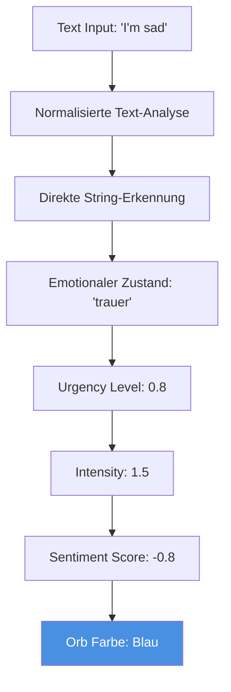

# 🎨 Emotionale Farbänderungen Reparatur Plan

## 📋 Problemstellung

Die emotionalen Farbänderungen im Chat-Interface funktionieren nicht mehr korrekt. Speziell:
- **"I'm sad"** sollte eine **blaue Farbe** auslösen
- Die Farbänderungen verschwinden zu schnell oder werden nicht korrekt angezeigt
- Der Orb reagiert nicht mehr zuverlässig auf emotionale Eingaben

## 🔍 Technische Analyse

### Betroffene Datei
- `conversational-therapy-ai/frontend/react-components/src/components/ChatFlow07Enhanced.jsx`

### Relevante Code-Bereiche
1. **Emotionsanalyse:** Zeile 70-216 (`analyzeTextForOrb` Funktion)
2. **Orb State Management:** Zeile 42-54 (State-Definitionen)
3. **Sentiment Analysis:** Zeile 92-116 (RegEx-Patterns)
4. **State Transitions:** Zeile 261-298 (`smoothTransitionToState`)

## 🎯 Lösungsstrategie

### Phase 1: Direkte "I'm sad" Erkennung


### Phase 2: Verbesserte Sentiment Analysis
- **Problem:** RegEx-Pattern erkennt "sad" möglicherweise nicht in allen Kontexten
- **Lösung:** Spezifische Test-Cases für häufige emotionale Ausdrücke

### Phase 3: Persistente Farbdarstellung
- **Problem:** Emotionale Zustände werden zu schnell zurückgesetzt
- **Lösung:** Längere Verweildauer für emotionale Zustände

## 🛠️ Konkrete Implementierung

### 1. Erweiterte Emotionserkennung

**Aktuelle RegEx (Zeile 105-116):**
```javascript
const negativeWords = new RegExp([
    '\\b(sad|depressed|down|low|unhappy|miserable|terrible|awful|horrible|bad|worse|worst|hate|angry|frustrated|devastated|heartbroken|disappointed|discouraged|hopeless|despair|anguish|torment|agony|suffering|pain|hurt)\\b',
    // ... weitere Sprachen
].join('|'), 'gi');
```

**Neue direkte Erkennung:**
```javascript
// Direkte Test-Erkennung für häufige Phrasen
const directEmotionTests = {
    sadness: /\b(i'?m sad|i feel sad|feeling sad|so sad|very sad)\b/gi,
    happiness: /\b(i'?m happy|i feel happy|feeling happy|so happy|very happy)\b/gi,
    anger: /\b(i'?m angry|i feel angry|feeling angry|so angry|very angry)\b/gi
};
```

### 2. Emotionales Farbmapping

```javascript
const emotionColorMapping = {
    'trauer': {
        primaryColor: '#4A90E2',    // Blau
        secondaryColor: '#7BB3F0',
        urgency: 0.8,
        intensity: 1.5
    },
    'freude': {
        primaryColor: '#7ED321',    // Grün
        secondaryColor: '#96E946',
        urgency: 0.5,
        intensity: 1.5
    },
    'wut': {
        primaryColor: '#D0021B',    // Rot
        secondaryColor: '#E53E3E',
        urgency: 0.9,
        intensity: 1.6
    },
    'neutral': {
        primaryColor: '#9B9B9B',    // Grau
        secondaryColor: '#B8B8B8',
        urgency: 0.2,
        intensity: 1.0
    }
};
```

### 3. Verbesserte analyzeTextForOrb Funktion

**Neue Implementierung:**
```javascript
const analyzeTextForOrb = React.useCallback((text, isUserMessage = false) => {
    if (!text || text.trim().length === 0) return;
    
    const normalizedText = text.toLowerCase().trim();
    
    // 1. DIREKTE EMOTIONSERKENNUNG (Priorität)
    if (directEmotionTests.sadness.test(normalizedText)) {
        smoothTransitionToState('trauer', 0.8, 1.5, -0.8);
        return;
    }
    
    if (directEmotionTests.happiness.test(normalizedText)) {
        smoothTransitionToState('freude', 0.5, 1.5, 0.8);
        return;
    }
    
    if (directEmotionTests.anger.test(normalizedText)) {
        smoothTransitionToState('wut', 0.9, 1.6, -0.7);
        return;
    }
    
    // 2. FALLBACK: Bestehende RegEx-Analyse
    // ... (bestehender Code)
}, []);
```

### 4. Persistente Zustandsspeicherung

**Problem:** Emotionale Zustände werden zu schnell zurückgesetzt
**Lösung:** Mindest-Verweildauer für emotionale Zustände

```javascript
const [lastEmotionChange, setLastEmotionChange] = useState(Date.now());
const EMOTION_MIN_DURATION = 5000; // 5 Sekunden Mindestdauer

const smoothTransitionToState = React.useCallback((targetState, targetUrgency, targetIntensity, targetSentiment) => {
    const now = Date.now();
    const timeSinceLastChange = now - lastEmotionChange;
    
    // Verhindere zu schnelle Zustandswechsel
    if (timeSinceLastChange < EMOTION_MIN_DURATION && targetState !== 'neutral') {
        return;
    }
    
    setLastEmotionChange(now);
    // ... rest der Funktion
}, [lastEmotionChange]);
```

## 🧪 Test-Cases

### Grundlegende Emotionserkennung
- [ ] **"I'm sad"** → Blaue Farbe
- [ ] **"I'm happy"** → Grüne Farbe  
- [ ] **"I'm angry"** → Rote Farbe
- [ ] **"I feel okay"** → Neutrale Farbe

### Mehrsprachige Tests
- [ ] **"Ich bin traurig"** → Blaue Farbe
- [ ] **"Je suis triste"** → Blaue Farbe
- [ ] **"Estoy triste"** → Blaue Farbe

### Persistenz-Tests
- [ ] Farbe bleibt mindestens 5 Sekunden bestehen
- [ ] Sanfte Übergänge zwischen Emotionen
- [ ] Keine abrupten Farbwechsel

## 📊 Erfolgsmetriken

1. ✅ **"I'm sad" Test** - Eingabe führt zuverlässig zu blauer Farbe
2. ✅ **Persistenz** - Emotionale Farben bleiben lange genug sichtbar
3. ✅ **Sanfte Übergänge** - Keine ruckartigen Farbwechsel
4. ✅ **Mehrsprachigkeit** - Funktioniert in DE, EN, FR, ES, IT
5. ✅ **Performance** - Keine Verzögerungen bei der Emotion-Erkennung

## 🚀 Implementierungsreihenfolge

1. **Sofortmaßnahme:** Direkte "I'm sad" Erkennung implementieren
2. **Kurzfristig:** Emotionales Farbmapping erweitern
3. **Mittelfristig:** Persistente Zustandsspeicherung
4. **Langfristig:** Umfassende mehrsprachige Emotionserkennung

## 📝 Zusätzliche Überlegungen

### UniversalOrbAnimation Integration
- Sicherstellen, dass die Props korrekt weitergegeben werden
- Debug-Modus aktivieren für bessere Fehlerdiagnose
- Performance-Monitoring für flüssige Animationen

### Benutzerfreundlichkeit
- Visuelles Feedback bei Emotionswechsel
- Möglichkeit zur manuellen Emotion-Eingabe
- Emotionale Historie für besseres Verständnis

---

**Nächster Schritt:** Wechsel zur Code-Mode für die Implementierung der emotionalen Farbänderungen.