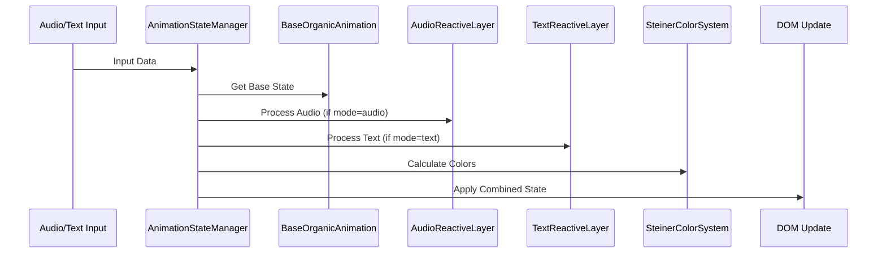

# 🔧 UniversalOrbAnimation - Technische Spezifikation

## 📋 **Übersicht**

Die `UniversalOrbAnimation` Komponente ist das Herzstück des neuen organischen Orb-Animationssystems. Sie vereint alle Funktionalitäten für Audio-Reaktivität, Text-Reaktivität und Basis-organische Animation in einer einheitlichen, wiederverwendbaren Komponente.

---

## 🏗️ **Architektur**

### **Komponenten-Hierarchie**
```
UniversalOrbAnimation/
├── BaseOrganicAnimation      // Kontinuierliche Basis-Animation
├── AudioReactiveLayer        // Audio-Analyse und Reaktion
├── TextReactiveLayer         // Text-Sentiment und Emotion
├── SteinerColorSystem        // Rudolf Steiner Farbsystem
├── PerformanceManager        // FPS und Memory Management
└── AnimationStateManager     // Zustandsübergänge
```

### **Animation-Pipeline**


---

## 🎯 **API Spezifikation**

### **Props Interface**
```typescript
interface UniversalOrbAnimationProps {
  // Modus-Konfiguration
  mode: 'base' | 'audio' | 'text' | 'emotional' | 'ambient';
  
  // Basis-Eigenschaften
  baseSize: number;                    // Standard: 347.04
  className?: string;
  style?: React.CSSProperties;
  
  // Audio-Modus (mode='audio')
  audioData?: {
    amplitude: number;                 // 0-1, normalisierte Lautstärke
    frequency: number;                 // 0-1, dominante Frequenz
    rhythm?: number;                   // 0-1, Rhythmus-Intensität
    spectrum?: number[];               // Frequenz-Spektrum Array
  };
  
  // Text-Modus (mode='text')
  emotionalState?: 'neutral' | 'freude' | 'trauer' | 'wut' | 'trauma';
  urgencyLevel?: number;               // 0-1, Dringlichkeit
  textInput?: string;                  // Aktueller Text für Analyse
  sentimentScore?: number;             // -1 bis 1, Sentiment
  
  // Emotional-Modus (mode='emotional')
  taskType?: string;
  emotionalContext?: object;
  
  // Ambient-Modus (mode='ambient')
  ambientData?: object;
  
  // Gemeinsame Eigenschaften
  intensity?: number;                  // 0.1-3.0, Animation-Intensität
  steinerState?: string;              // Rudolf Steiner Farbzustand
  isVisible?: boolean;                // Sichtbarkeit
  
  // Performance
  targetFPS?: number;                 // Standard: 30
  enableDebug?: boolean;              // Debug-Informationen
  
  // Callbacks
  onAnimationFrame?: (state: AnimationState) => void;
  onStateChange?: (newState: string) => void;
  onPerformanceUpdate?: (metrics: PerformanceMetrics) => void;
}
```

### **Animation State Interface**
```typescript
interface AnimationState {
  // Basis-Animation
  breathing: {
    phase: number;                     // 0-1, aktuelle Atem-Phase
    scale: number;                     // Aktueller Skalierungsfaktor
  };
  
  morphing: {
    phase: number;                     // 0-1, aktuelle Morphing-Phase
    borderRadius: string;              // CSS border-radius Wert
    variation: number;                 // 0-4, aktuelle Variation
  };
  
  glowing: {
    phase: number;                     // 0-1, aktuelle Glow-Phase
    intensity: number;                 // Glow-Intensität
    color: string;                     // Glow-Farbe
  };
  
  // Reaktive Layer
  reactive: {
    mode: string;                      // Aktueller Modus
    intensity: number;                 // Reaktive Intensität
    sizeMultiplier: number;           // Größen-Multiplikator
    colorState: string;               // Aktueller Farbzustand
  };
  
  // Performance
  performance: {
    fps: number;
    frameTime: number;
    memoryUsage: number;
  };
}
```

---

## 🎨 **Rudolf Steiner Farbsystem**

### **Farbpaletten Definition**
```javascript
const STEINER_COLOR_PALETTES = {
  neutral: {
    primary: 'rgba(0, 255, 161, 0.8)',      // Beruhigendes Grün
    secondary: 'rgba(68, 140, 255, 0.6)',   // Harmonisches Blau
    tertiary: 'rgba(255, 187, 148, 0.4)',   // Warmes Beige
    glow: 'rgba(0, 255, 161, 0.6)',
    emotion: 'balanced',
    therapy: 'calming'
  },
  
  freude: {
    primary: 'rgba(255, 220, 100, 0.9)',    // Sonniges Gelb
    secondary: 'rgba(255, 187, 148, 0.7)',  // Warmes Orange
    tertiary: 'rgba(255, 255, 200, 0.5)',   // Helles Gelb
    glow: 'rgba(255, 220, 100, 0.7)',
    emotion: 'uplifting',
    therapy: 'energizing'
  },
  
  trauer: {
    primary: 'rgba(100, 150, 255, 0.8)',    // Sanftes Blau
    secondary: 'rgba(68, 140, 255, 0.9)',   // Tieferes Blau
    tertiary: 'rgba(150, 200, 255, 0.6)',   // Helles Blau
    glow: 'rgba(100, 150, 255, 0.6)',
    emotion: 'soothing',
    therapy: 'comforting'
  },
  
  wut: {
    primary: 'rgba(255, 120, 120, 0.9)',    // Energisches Rot
    secondary: 'rgba(255, 80, 80, 0.8)',    // Intensives Rot
    tertiary: 'rgba(200, 100, 100, 0.7)',   // Gedämpftes Rot
    glow: 'rgba(255, 120, 120, 0.7)',
    emotion: 'intense',
    therapy: 'releasing'
  },
  
  trauma: {
    primary: 'rgba(180, 80, 80, 1.0)',      // Tiefes Rot
    secondary: 'rgba(150, 60, 60, 0.9)',    // Sehr tiefes Rot
    tertiary: 'rgba(120, 40, 40, 0.8)',     // Dunkles Rot
    glow: 'rgba(180, 80, 80, 0.8)',
    emotion: 'deep',
    therapy: 'grounding'
  }
};
```

### **Dynamische Farbberechnung**
```javascript
function calculateDynamicColor(baseState, intensity, context) {
  const palette = STEINER_COLOR_PALETTES[baseState];
  
  // Intensität auf Farbsättigung anwenden
  const adjustedPrimary = adjustColorIntensity(palette.primary, intensity);
  
  // Kontext-basierte Anpassungen
  const contextualColor = applyTherapeuticContext(adjustedPrimary, context);
  
  return {
    gradient: createRadialGradient(adjustedPrimary, palette.secondary, palette.tertiary),
    glow: calculateGlowColor(palette.glow, intensity),
    therapeutic: palette.therapy
  };
}
```

---

## ⚡ **Performance-Optimierung**

### **Adaptive Frame Rate**
```javascript
class PerformanceManager {
  constructor() {
    this.targetFPS = 30;
    this.audioTargetFPS = 60;
    this.minFPS = 15;
    this.maxFPS = 60;
  }
  
  adaptiveFrameRate(mode, deviceCapabilities) {
    switch(mode) {
      case 'audio':
        return this.audioTargetFPS; // 60 FPS für Audio-Reaktivität
      case 'text':
        return 30; // 30 FPS für Text-Reaktivität
      case 'ambient':
        return 20; // 20 FPS für Ambient-Modi
      default:
        return this.targetFPS;
    }
  }
  
  deviceAdaptation() {
    // Geräte-basierte Anpassung
    const deviceMemory = navigator.deviceMemory || 4;
    const hardwareConcurrency = navigator.hardwareConcurrency || 4;
    
    if (deviceMemory < 4 || hardwareConcurrency < 4) {
      return 'reduced'; // Reduzierte Animation-Komplexität
    }
    return 'full'; // Volle Animation-Intensität
  }
}
```

### **Memory Management**
```javascript
class AnimationMemoryManager {
  constructor() {
    this.bufferSize = 256;
    this.historyLimit = 10;
    this.cleanupInterval = 5000;
  }
  
  optimizeBuffers() {
    // Audio-Buffer optimieren
    if (this.audioBuffer && this.audioBuffer.length > this.bufferSize) {
      this.audioBuffer = this.audioBuffer.slice(-this.bufferSize);
    }
    
    // Animation-History begrenzen
    if (this.animationHistory.length > this.historyLimit) {
      this.animationHistory = this.animationHistory.slice(-this.historyLimit);
    }
  }
  
  scheduleCleanup() {
    setInterval(() => {
      this.optimizeBuffers();
      this.garbageCollectUnusedData();
    }, this.cleanupInterval);
  }
}
```

---

## 🔄 **Animation-Modi Details**

### **1. Base Modus (Immer aktiv)**
```javascript
const baseAnimationConfig = {
  breathing: {
    duration: 4000,           // 4 Sekunden
    amplitude: 0.03,          // ±3% Größenänderung
    easing: 'ease-in-out'
  },
  
  morphing: {
    duration: 8000,           // 8 Sekunden
    variations: 5,            // 5 verschiedene Formen
    intensity: 0.05,          // 5% max Abweichung
    smoothness: 0.8           // Glättung zwischen Formen
  },
  
  glowing: {
    duration: 6000,           // 6 Sekunden
    minIntensity: 0.3,
    maxIntensity: 0.6,
    colorShift: true          // Farbe ändert sich mit Intensität
  }
};
```

### **2. Audio Modus**
```javascript
const audioAnimationConfig = {
  amplitudeMapping: {
    minSize: 0.8,             // 80% bei Stille
    maxSize: 1.4,             // 140% bei max Lautstärke
    sensitivity: 0.8,
    smoothing: 0.3,           // Glättung für sanfte Übergänge
    responsiveness: 0.9       // Reaktionsgeschwindigkeit
  },
  
  frequencyMapping: {
    lowFreq: {
      range: [20, 250],       // Bass-Bereich
      effect: 'size',         // Größe beeinflussen
      multiplier: 1.2
    },
    midFreq: {
      range: [250, 4000],     // Mitten-Bereich
      effect: 'morphing',     // Morphing-Intensität
      multiplier: 1.5
    },
    highFreq: {
      range: [4000, 20000],   // Höhen-Bereich
      effect: 'glow',         // Glow-Intensität
      multiplier: 2.0
    }
  },
  
  rhythmDetection: {
    beatThreshold: 0.7,       // Schwelle für Beat-Erkennung
    rhythmSmoothing: 0.5,     // Rhythmus-Glättung
    syncDelay: 50             // Sync-Verzögerung in ms
  }
};
```

### **3. Text Modus**
```javascript
const textAnimationConfig = {
  emotionalMapping: {
    neutral: {
      sizeMultiplier: 1.0,
      morphingIntensity: 1.0,
      colorTransition: 'neutral',
      duration: 3000
    },
    freude: {
      sizeMultiplier: 1.2,
      morphingIntensity: 1.5,
      colorTransition: 'freude',
      duration: 4000,
      buoyancy: true          // Lebhafte Animation
    },
    trauer: {
      sizeMultiplier: 0.8,
      morphingIntensity: 0.5,
      colorTransition: 'trauer',
      duration: 6000,
      gentleness: true        // Sanfte Animation
    },
    wut: {
      sizeMultiplier: 1.3,
      morphingIntensity: 2.0,
      colorTransition: 'wut',
      duration: 2000,
      intensity: true         // Intensive Animation
    },
    trauma: {
      sizeMultiplier: 0.9,
      morphingIntensity: 0.8,
      colorTransition: 'trauma',
      duration: 8000,
      depth: true             // Tiefe, meditative Animation
    }
  },
  
  urgencyMapping: {
    low: { multiplier: 0.8, speed: 0.8 },
    medium: { multiplier: 1.2, speed: 1.2 },
    high: { multiplier: 1.6, speed: 1.6 },
    critical: { multiplier: 2.0, speed: 2.0 }
  }
};
```

---

## 🧪 **Testing & Validation**

### **Unit Tests**
```javascript
describe('UniversalOrbAnimation', () => {
  test('Basis-Animation läuft kontinuierlich', () => {
    const component = render(<UniversalOrbAnimation mode="base" />);
    // Test kontinuierliche Animation
  });
  
  test('Audio-Reaktivität funktioniert', () => {
    const audioData = { amplitude: 0.8, frequency: 0.5 };
    const component = render(
      <UniversalOrbAnimation mode="audio" audioData={audioData} />
    );
    // Test Audio-Reaktion
  });
  
  test('Rudolf Steiner Farben korrekt', () => {
    const component = render(
      <UniversalOrbAnimation emotionalState="freude" />
    );
    // Test Farbberechnung
  });
});
```

### **Performance Tests**
```javascript
describe('Performance', () => {
  test('FPS bleibt über 30', () => {
    const monitor = new PerformanceMonitor();
    // Test FPS über längeren Zeitraum
  });
  
  test('Memory-Verbrauch stabil', () => {
    // Test Memory-Leaks
  });
});
```

---

## 📦 **Datei-Struktur**

```
src/components/
├── UniversalOrbAnimation/
│   ├── UniversalOrbAnimation.jsx        // Hauptkomponente
│   ├── UniversalOrbAnimation.css        // Styling
│   ├── index.js                         // Export
│   └── README.md                        // Komponenten-Doku
│
src/services/
├── orbAnimationEngine.js                // Animation Engine
├── steinerColorSystem.js                // Farbsystem
├── performanceManager.js                // Performance
└── animationStateManager.js             // Zustandsmanagement
│
src/utils/
├── animationHelpers.js                  // Helper-Funktionen
├── colorUtils.js                        // Farb-Utilities
└── mathUtils.js                         // Mathematische Funktionen
```

---

## ✅ **Implementierungs-Checkliste**

### **Phase 1.1: Core Komponente**
- [ ] UniversalOrbAnimation.jsx erstellen
- [ ] Basis-Animation implementieren
- [ ] Props-Interface definieren
- [ ] CSS-Framework aufsetzen

### **Phase 1.2: Animation Engine**
- [ ] BaseOrganicAnimation Service
- [ ] AudioReactiveLayer Service
- [ ] TextReactiveLayer Service
- [ ] AnimationStateManager

### **Phase 1.3: Farbsystem**
- [ ] SteinerColorSystem Service
- [ ] Farbpaletten implementieren
- [ ] Dynamische Farbberechnung
- [ ] Übergänge optimieren

### **Phase 1.4: Performance**
- [ ] PerformanceManager implementieren
- [ ] Memory Management
- [ ] Adaptive Frame Rate
- [ ] Device Adaptation

### **Phase 1.5: Testing**
- [ ] Unit Tests schreiben
- [ ] Performance Tests
- [ ] Integration Tests
- [ ] Browser-Kompatibilität

---

**Status**: ✅ Spezifikation vollständig - Bereit für Implementierung  
**Nächster Schritt**: Code-Modus für Implementierung von Phase 1.1