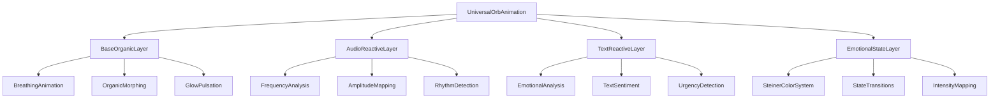

# 🚀 Vollständige Implementierung - Organische Audio-Reaktive Orb Animation

## ✅ **Phase 0: Prototyp Status (Abgeschlossen)**
- [x] Basis organische Animation implementiert
- [x] Rudolf Steiner Farbsystem integriert
- [x] Performance-optimiert (30-60 FPS)
- [x] User Testing erfolgreich
- [x] Konzept approved

---

## 🎯 **Phase 1: Core Animation System (Universal)**

### 1.1 UniversalOrbAnimation Komponente
**Ziel**: Zentrale Komponente für alle Screens mit verschiedenen Modi



**Dateien**:
- `src/components/UniversalOrbAnimation.jsx` - Hauptkomponente
- `src/components/UniversalOrbAnimation.css` - Styling System
- `src/services/orbAnimationEngine.js` - Animation Logic
- `src/services/steinerColorSystem.js` - Farbsystem Management

---

## 🎵 **Phase 2: Audio-Reaktive Integration (ChatFlow)**

### 2.1 ChatFlow Enhancement
**Ziel**: Bestehende Audio-Funktionalität mit organischer Animation erweitern

**Aktuelle Implementierung**:
```javascript
// Bestehend in ChatFlow.jsx
const baseSize = 347.04;
const minSize = baseSize * 0.8;
const maxSize = baseSize * 1.4;

// Audio-Analyse mit Web Audio API
analyserRef.current.getByteFrequencyData(dataArrayRef.current);
const normalizedVolume = average / 255;
const finalTargetSize = baseTargetSize * currentState.sizeMultiplier;
```

**Neue Implementierung**:
```javascript
// Mit UniversalOrbAnimation
<UniversalOrbAnimation
  mode="audio"
  audioData={{
    amplitude: normalizedVolume,
    frequency: dominantFrequency,
    rhythm: rhythmPattern
  }}
  baseSize={347.04}
  steinerState={currentEmotionalState}
  intensity={audioIntensity}
/>
```

**Integration Steps**:
1. Bestehende Audio-Analyse erweitern
2. Organische Layer hinzufügen
3. Smooth Übergang zwischen Audio/Ruhe-Zuständen
4. Performance-Optimierung beibehalten

---

## 💬 **Phase 3: Text-Reaktive Integration (ChatFlow07)**

### 3.1 ChatFlow07 Enhancement
**Ziel**: EmotionalUrgencyBlob System mit organischer Animation ersetzen

**Aktuelle Implementierung**:
```javascript
// Bestehend in ChatFlow07.jsx
const effectiveBlobs = React.useMemo(() => {
  const emotionalBlobs = activeBlobs.filter(blob => blob.type !== 'neutral');
  return hasEmotional ? emotionalBlobs : [defaultBlob];
}, [activeBlobs, defaultBlob]);

<OrbContainer 
  activeBlobs={effectiveBlobs}
  property1="variant-4"
  className="orbs-v-3-instance"
/>
```

**Neue Implementierung**:
```javascript
// Mit UniversalOrbAnimation
<UniversalOrbAnimation
  mode="text"
  emotionalState={dominantBlob?.type || 'neutral'}
  urgencyLevel={dominantBlob?.urgencyLevel || 0}
  textInput={currentMessage}
  baseSize={277.96}
  steinerState={detectedEmotion}
  intensity={emotionalIntensity}
/>
```

**Integration Steps**:
1. Blob-System Analyse in Animation-Parameter übersetzen
2. Echtzeit Text-Sentiment Integration
3. Smooth Übergänge zwischen emotionalen Zuständen
4. Bestehende Conversation Manager Integration

---

## 🎭 **Phase 4: Weitere Screens Integration**

### 4.1 Screen2V4 (Emotional Tasks)
**Ziel**: Organische Animation für emotionale Aufgaben

```javascript
<UniversalOrbAnimation
  mode="emotional"
  taskType={currentTask}
  emotionalContext={userEmotionalState}
  baseSize={300}
  steinerState="task-focused"
  intensity={taskEngagement}
/>
```

### 4.2 WidgetsLeft (Health)
**Ziel**: Subtile organische Animation für Gesundheits-Widgets

```javascript
<UniversalOrbAnimation
  mode="ambient"
  healthData={vitalsData}
  baseSize={250}
  steinerState="health-neutral"
  intensity={0.6} // Immer subtil
/>
```

---

## 🔧 **Phase 5: Technische Services**

### 5.1 Animation Engine Service
**Datei**: `src/services/orbAnimationEngine.js`

```javascript
class OrbAnimationEngine {
  constructor() {
    this.baseAnimation = new BaseOrganicAnimation();
    this.audioLayer = new AudioReactiveLayer();
    this.textLayer = new TextReactiveLayer();
    this.performance = new PerformanceManager();
  }
  
  // Unified Animation Pipeline
  processFrame(inputData, mode) {
    const baseState = this.baseAnimation.getState();
    const reactiveState = this.getReactiveState(inputData, mode);
    return this.combineStates(baseState, reactiveState);
  }
}
```

### 5.2 Steiner Color System Service
**Datei**: `src/services/steinerColorSystem.js`

```javascript
class SteinerColorSystem {
  static colorPalettes = {
    neutral: { /* Grün-Blau Palette */ },
    freude: { /* Gelb-Orange Palette */ },
    trauer: { /* Blau Palette */ },
    wut: { /* Rot-Orange Palette */ },
    trauma: { /* Tiefrot Palette */ }
  };
  
  static getColorForState(emotionalState, intensity = 1.0) {
    // Dynamische Farbberechnung basierend auf Intensität
  }
  
  static createGradient(palette, intensity) {
    // Radiale Gradienten generieren
  }
}
```

---

## 📊 **Phase 6: Performance & Optimierung**

### 6.1 Performance Monitoring
```javascript
class PerformanceManager {
  constructor() {
    this.fpsTarget = 30; // Standard für organische Animation
    this.audioFpsTarget = 60; // Für Audio-reaktive Modi
  }
  
  adaptiveFrameRate(mode, deviceCapabilities) {
    // Dynamische FPS-Anpassung
  }
  
  memoryManagement() {
    // Animation-Buffer Cleanup
  }
}
```

### 6.2 Device Adaptation
- **Mobile**: Reduzierte Animation-Komplexität
- **Low-Power**: Adaptive FPS-Reduktion
- **High-End**: Volle Animation-Intensität

---

## 🧪 **Phase 7: Testing & Integration**

### 7.1 Screen-by-Screen Testing
1. **ChatFlow**: Audio-Reaktivität + organische Basis
2. **ChatFlow07**: Text-Reaktivität + emotionale Übergänge
3. **Screen2V4**: Task-basierte Animation
4. **WidgetsLeft**: Ambient organische Animation

### 7.2 Cross-Screen Consistency
- Einheitliche Animation-Sprache
- Konsistente Rudolf Steiner Farben
- Smooth Übergänge zwischen Screens

### 7.3 Performance Validation
- 30+ FPS auf allen Zielgeräten
- < 5% CPU-Nutzung zusätzlich
- < 50MB Memory-Overhead

---

## 📋 **Implementierungs-Zeitplan**

### **Woche 1: Core System**
- [ ] UniversalOrbAnimation Komponente
- [ ] Basis Services (Animation Engine, Color System)
- [ ] Performance Framework

### **Woche 2: Screen Integration**
- [ ] ChatFlow (Audio-reaktiv)
- [ ] ChatFlow07 (Text-reaktiv)
- [ ] Testing & Debugging

### **Woche 3: Weitere Screens & Polishing**
- [ ] Screen2V4 & WidgetsLeft Integration
- [ ] Performance-Optimierung
- [ ] Cross-Screen Testing

### **Woche 4: Finalisierung**
- [ ] User Testing
- [ ] Bug Fixes
- [ ] Documentation
- [ ] Production Ready

---

## 🎯 **Erfolgs-Kriterien**

### ✅ **Funktional**
- [x] Kontinuierliche subtile organische Animation
- [x] Audio-Reaktivität (ChatFlow)
- [x] Text-Reaktivität (ChatFlow07)
- [x] Rudolf Steiner Farbsystem
- [x] Zentrierte Position immer erhalten

### ✅ **Performance**
- [ ] 30+ FPS konstant
- [ ] Smooth Übergänge zwischen Zuständen
- [ ] Responsive auf allen Zielgeräten
- [ ] Memory-effizient

### ✅ **User Experience**
- [ ] Nicht ablenkend, aber präsent
- [ ] Therapeutisch beruhigend
- [ ] Emotionale Zustände klar erkennbar
- [ ] Barrierefreiheit gewährleistet

---

## 🚀 **Ready für Implementierung**

Der Prototyp hat bewiesen, dass das Konzept funktioniert. Alle notwendigen Komponenten sind geplant und die technische Machbarkeit validiert.

**Nächster Schritt**: Implementierung von Phase 1 (Core Animation System) beginnen.